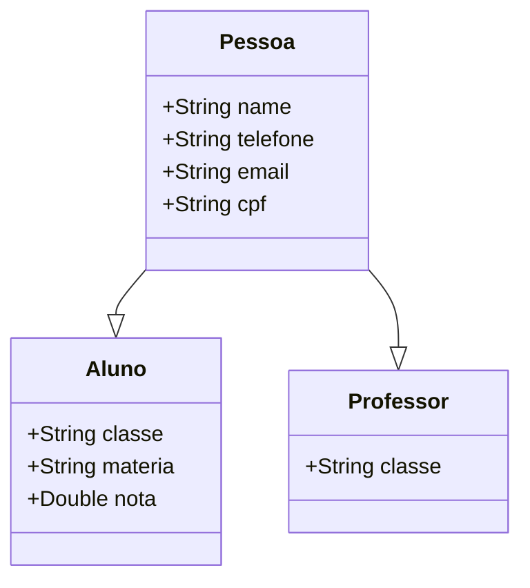

# Lógica de Programação

## Introdução à Computação e à Lógica Computacional

### Introdução à computação

- O computador é uma máquina eletrônica programável capaz de processar, armazenar e recuperar informações de dados;
- No começo serviam apenas para calcular operações básicas, como: soma, subtração, multiplicação e divisão;
- Em 1946 foi anunciado o primeiro computador digital, conhecido como ENIAC (Electrical Numerical Integrator and Calculator);
- No período de 1951 a 1959 surgiu a primeira geração de computadores. Esses eram capazes de realizar cálculos em milésimos de segundos e programados utilizando a linguagem de máquina;
- De 1959 a 1965 surgiu a segunda geração dos computadores, os quais calculavam a uma velocidade de microssegundos e eram programados em linguagem de montadora;
- A terceira geração surgiu entre 1965 a 1975, quando os equipamentos passaram a ter diversos componentes miniaturizados e montados em um único chip, bem como a realizar operações em nano segundos;
- Durante o período de 1975 a 1981 apareceram os computadores da quarta geração. Seguindo a tendência da geração anterior, os componentes continuaram miniaturizados e os circuitos integrados (CI) aperfeiçoados;
- Na Idade Moderna o computador é dividido em unidades lógicas, sendo elas:
  - **Unidade de entrada**: recebe informações obtidas por meio de periféricos, como: teclado, mouse, impressora, câmera, touch, dentre outros, que fornecem dados ao computador;
  - **Unidade de saída**: ilustra as informações ao usuário, que podem ser exibidas por meio do monitor de computador ou impressas em uma folha de papel usando dispositivo de impressão, ou seja, tornando a informação acessível externamente;
  - **Memória principal**: o computador possui a opção de armazenamento de informações para processamento no sistema operacional e em programas computacionais;
  - **Unidade de processamento central**: do inglês central process unit (CPU), concentra todas as operações lógicas e aritméticas, tornando-se o principal item do computador;
  - **Unidade de armazenamento secundária**: quando tratamos dessa unidade, pensamos em dispositivos que possuem grande capacidade de armazenamento a longo prazo, exemplos: HD, SSD, pen drive, DVD, CD etc.

### Noções de lógica

- Pensar logicamente se refere ao ato de raciocinar a fim de resolver determinado problema, ou refletir sobre um assunto;
- Pensar logicamente é muitas das vezes utilizado em pesquisas científicas, testando hipóteses e ajustando as metodologias conforme se obtém os resultados.

#### O que é lógica

- A lógica está correlacionada aos pensamentos que têm coerência e racionalidade, sendo assim um conjunto de ideias para atingir o objetivo, esse tema foi estudado por Aristóteles (384 a.C - 322 a.C);
- Compreender e utilizar a lógica em nossas atividades consequentemente gera facilidades durante a resolução de problemas;
- Podemos nos tornar mais estrategistas em organizar e desenvolver ideias brilhantes para qualquer atividade que tenhamos que realizar.

#### Relação entre lógica e programação

- Podemos definir _programação_ como o processo de escrita do programa de computador, a realização de testes e a manutenção;
- O programa escrito utiliza todo o conjunto de semântica e sintaxe de uma linguagem, reunindo um conjunto de técnicas, como lógica, conhecimento na linguagem de programação e compreensão do problema;
- A relação da lógica com a programação pode ser definida como o conjunto de pensamentos e ideias que nos faz refletir sobre as estratégias até chegarmos a uma solução viável.

### Algoritmos

- Um algoritmo é considerado uma sequência lógica ordenada de ações aplicadas à resolução de algum problema;
- São amplamente utilizados em áreas da ciência e principalmente em exatas;
- O algoritmo está diretamente associado à etapa do desenvolvimento de um software;
- Exemplo de um algoritmo para calcular três números:
  - Passo 1: receba três números;
  - Passo 2: multiplique os três números;
  - Passo 3: mostre o resultado.

#### A importância da construção de algoritmos

- A construção de um algoritmo é realizada quando as ações já estão definidas para a solução de um problema;
- O próprio sistema operacional é um conjunto de soluções implementado utilizando a lógica e as pesquisas científicas para chegar à solução atual;
- A importância dos algoritmos é tão grande que outras áreas, como a medicina, a bioinformática, a engenharia, entre outras, utilizam softwares implementados por desenvolvedores para avaliar ou simular alguma solução.

#### Modos de retratar a lógica

##### Fluxogramas

- O fluxograma consiste na análise e na escrita do problema por meio de símbolos gráficos que representam as ações ou as instruções a serem seguidas;
- A estrutura de um fluxograma é muito utilizada na organização do pensamento, na documentação de rotinas de sistemas, e seu uso é recomendado para problemas pequenos, como ilustrado a seguir:
  
- Para a construção de fluxogramas utilizamos uma simbologia. Iniciamos com o terminal; em seguida, utilizamos as setas para mostrar qual o próximo processamento, no caso, o símbolo de teclado para entrada dos dados e o de retângulo, também conhecido como processamento, para realização dos cálculos; depois, usamos o símbolo de vídeo para exibir o resultado; por fim, finalizamos com o terminal;
- Simbologia do fluxograma:
  

##### Pseudocódigos

- Pseudocódigo, também conhecido como portugol, é a maneira utilizada para analisar e escrever a solução de um problema de fácil entendimento;
- Possui a vantagem de ser escrito em linguagem próxima à linguagem de programação, respeitando a sintaxe e a semântica;
- Descrição do algoritmo de multiplicação de três números em pseudocódigo:

  ```
  Var
    N1, N2, N3: Numerico
  Inicio
    Escreva "Digite três números: "
    Leia (N1, N2, N3)
    R <- (N1 * N2 * N3)
    Escreva ("Multiplicação = ", R)
  Fimalgoritmo
  ```

- O pseudocódigo possui uma desvantagem que muitos poderiam dizer ser redundante.

### Teste de mesa

- Testes de mesa tem como finalidade o teste lógico do algoritmo, no qual, conhecendo a entrada de informação e todo o processamento interno do algoritmo, a saída deve corresponder ao resultado esperado;
- Testes de mesa geralmente são utilizados para problemas simples;
- Para testes complexos existem ferramentas que auxiliam nos teste e até mesmo do desenvolvimento, realizando o teste de modo indireto e exibindo a linha do provável erro.

### Ambientes de programação

- IDE (Integrated Development Environment - Ambiente de Programação Integrado);
  - Sistema desenvolvido que unifica vários plugins em um única ferramente (DEITEL; DEITEL, 2009);
  - No geral, inclui um editor para a escrita e a edição dos arquivos, depuradores utilizados na localização de prováveis erros lógicos;
  - A utilização de uma IDE traz benefícios como o aumento na produtividade do desenvolvedor, a economia financeira e, principalmente, o desempenho no desenvolvimento.

## Linguagem de programação Java I

### A linguagem de programação Java

- A primeira versão estável da linguagem Java ficou concluída em 1996;
- O Java possui 11 características-chave que fazem com que seja um bom recurso para o desenvolvedor, são elas:
  - Simplicidade;
  - Orientação a objetos;
  - Compatibilidade com redes;
  - Robustez;
  - Segurança;
  - Arquitetura neutra;
  - Portabilidade;
  - Interpretação;
  - Alto desempenho;
  - Múltiplas threads;
  - Dinamicidade.
- É uma linguagem _compilada e interpretada_;
  - O código Java (.java) é compilado em _bytecode_ (.class);
  - O bytecode é interpretado pela **JVM** (Java Virtual Machine - Máquina Virtual Java), isso permite a portabilidade da linguagem, pois basta o sistema operacional possuir a JVM instalada que os programas feitos em Java podem ser executados.

### Conceitos básicos da linguagem Java

- Abaixo um exemplo de um programa que exibe a mensagem **Hello World** feito em Java:

  ```
  public class HelloWorld {
    public static void main (String [] args) {
      System.out.println ("Hello World!");
    }
  }
  ```

  - Na primeira linha informamos que se trata de uma _classe_ (class), _publica_ (public), seu nome é _HelloWorld_, e por fim, a _abertura da chave de bloco_ ({);
    - Uma boa prática no desenvolvimento da linguagem Java é a nomenclatura das **classes** usar o padrão **PascalCase**, onde a primeira letra de cada palavra é iniciada com letra maiúscula, exemplo: **NomeDaClasseEmPascalCase**;
  - Na segunda linha define o método principal que inicia a execução do programa Java, nela definimos que é um método _publico_ (public), possui um modificador de acesso _estático_ (static), não possui _retorno_ (void), seu nome é _main_, possui como entrada um _lista de textos_ (String [] args), e por fim, a abertura da chave de bloco ({);
    - Para nomenclatura de **métodos** e **variáveis** em Java, usamos o padrão **camelCase**, onde a primeira letra da primeira palavra é minúscula, seguindo da primeira letra das palavras restantes em maiúscula, exemplo: metodoEmCamelCase;
  - Na terceira linha utilizamos o **objeto** _System.out.println_ para comandar o computador à fazer a saída do texto ("Hello World!"), por fim, utilizamos o _ponto e vírgula_ ( ; ) para finalizar o comando;
    - Todo comando em Java tem que ser finalizado com ponto e vírgula;
  - Na quarta e quinta linha, temos os fechamentos das chaves de blocos da classe e do método;
    - Toda classe e método em Java precisam ter as chaves de abertura e fechamento, chamamos isso de **escopo**, onde todo o código inserido entre as chaves de abertura e fechamento, pertencem ao escopo daquele bloco;
  - **Observação**: a nomenclatura de classes, métodos e variáveis em Java, não poder ser iniciados com número ou caracteres especiais, salvo o caractere _underline_ ( \_ ), já no corpo no do nome é permitido números, mas não é permitido caracteres especiais salvo o underline, exemplos:
    Nome | Permissão
    --------|----------
    001Classe | N
    Classe001 | S
    metodoAçúcar | N
    metodoAcucar | S
    $variavel | N
    \_variavel | S

#### Comentários

- Muitas das vezes precisamos deixar comentários nos códigos, no Java existem dois tipos de comentários:

  - _Comentário de Linha_: utilizamos duas barras // e em seguida o texto do comentário, muito utilizado para comentários simples;
  - _Comentário de bloco_: utilizamos a barra com asteriscos, onde o texto fica entre elas, mais utilizado para comentários maiores ou documentação;
  - Exemplo:

    ```
    /*
      Esse é um
      comentário de
      bloco
    */

    public class HelloWorld {

      // Esse é um comentário de linha

      public static void main (String [] args) {
        System.out.println ("Hello World!");
      }
    }
    ```

  - Na hora da compilação do código Java para bytecode, o compilador ignora os texto descritos nos comentários.

#### Tipos de dados primitivos

- O Java é considerado uma linguagem **fortemente tipada**, isso significa todos os dados que são utilizados pela linguagem devem possuir um tipo definido, abaixo temos uma tabela com os dados _primitivos_ suportados pela linguagem:
  Tipo | Categoria | Quantidade de bits | Valores | Observação
  -----|-----------|--------------------|---------|-----------
  char | numérico | 16 | \u000 a \uFFF | utilizado para caracteres
  byte | numérico | 8 | -128 a 127 | números inteiros
  short | numérico | 16 | -32.768 a 32.767 | números inteiros
  int | numérico | 32 | -2.147.483.648 a 2.147.483.647 | números inteiros
  long | numérico | 64 | -9.223.372.036.854.775.808 a 9.223.372.036.854.775.807 | números inteiros
  float | numérico | 32 | -3.40292347E+38 a 3.40292347E+38 | números com casas decimais
  double | numérico | 64 | -1.797.693.134.862.315.70E+308 a 1.797.693.134.862.315.70E+308 | números com casas decimais
  boolean | lógico |8 | true ou false | controle de decisão

#### Variáveis

- Podemos definir uma variável como uma _caixinha_ na memória onde iremos guardar um valor;
- Na linguagem de programação Java, as variáveis são utilizadas para armazenar os dados que serão utilizados posteriormente;
- Uma variável em Java precisa ter o seu tipo definido;
- Variáveis em Java podem ter seus valores trocados, mas não os seus tipos;
- Exemplo de uma variável:

  ```
  int numero1 = 10;
  ```

  - No exemplo acima, criamos uma variável do tipo _inteiro_ (int), seu nome é _numero1_, atribuímos à ela o valor _10_, e por fim, finalizamos o comando com ponto e vírgula;

#### Operadores aritméticos, relacionais e lógicos

##### Operadores aritméticos

| Operador | Significado   |
| :------: | ------------- |
|    -     | Subtração     |
|    +     | Soma          |
|    \*    | Multiplicação |
|    /     | Divisão       |

- Exemplos:

```
 public class OperadoresAritmeticos {
   public static void main (String [] args) {
     int subtracao = 25 - 10;
     int soma = 25 + 25;
     int multiplicacao = 15 * 10;
     int divisao = 36 / 6;

     System.out.println("Resultado da subtração: " + subtracao);
     System.out.println("Resultado da soma: " + soma);
     System.out.println("Resultado da multiplicação: " + multiplicacao);
     System.out.println("Resultado da divisão: " + divisao);
   }
 }
```

##### Operadores relacionais

| Operador | Significado        |
| :------: | ------------------ |
|    ==    | Igual a            |
|    !=    | Diferente          |
|    >     | Maior que          |
|    <     | Menor que          |
|    >=    | Maior ou igual que |
|    <=    | Menor ou igual que |

- Exemplos:

```
 public class OperadoresRelacionais {
   public static void main (String [] args) {
     System.out.println(2 == 2);
     System.out.println(2 != 2);
     System.out.println(2 > 2);
     System.out.println(2 < 2);
     System.out.println(2 >= 2);
     System.out.println(2 <= 2);
   }
 }
```

##### Operadores lógicos

| Operador |      Significado      |
| :------: | :-------------------: |
|    &     |          AND          |
|    \|    |          OR           |
|    ^     |  XOR (exclusive OR)   |
|   \|\|   | OR de curto-circuito  |
|    &&    | AND de curto-circuito |
|    !     |          NOT          |

##### Ordem de procedência

|   Classificação mais alta    |             |     |     |            |           |
| :--------------------------: | :---------: | :-: | :-: | :--------: | :-------: |
|         ++(prefixo)          | --(prefixo) |     |     |            |           |
|         ++(posfixo)          | --(prefixo) |  ~  |  !  | +(unário)  | -(unário) |
|              \*              |      /      |  %  |     |            |           |
|              +               |      -      |     |     |            |           |
|              >>              |     >>>     | <<  |     |            |           |
|              >               |     >=      |  <  | <=  | Instanceof |           |
|              ==              |     !=      |     |     |            |           |
|              &               |             |     |     |            |           |
|              ^               |             |     |     |            |           |
|              \|              |             |     |     |            |           |
|              &&              |             |     |     |            |           |
|             \|\|             |             |     |     |            |           |
|              ?:              |             |     |     |            |           |
|              ->              |             |     |     |            |           |
|              =               |     op=     |     |     |            |           |
| **Classificação mais baixa** |             |     |     |            |           |

### Estruturas de decisão

- As estruturas de decisão são aplicadas no fluxo de execução dos algoritmos, possibilitando caminhos alternativos e a leitura de blocos que satisfaçam as condições (FILGUEIRAS, 2015);

#### IF - ELSE

- Exemplo de **IF** para aplicar um desconto de 15%:

```
  public class ExemploIF {
    public static void main (String [] args) {
      double valorProduto = 29.99;
      boolean temDesconto = true;
      double percentualDesconto = 0.15;

      if(temDesconto == true) {
        valorProduto = valorProduto - (valorProduto * percentualDesconto);
      }

      System.out.println("Valor do produto: " + valorProduto);
    }
  }
```

- Exemplo de **IF - ELSE** para verificar se o número é par:

```
  public class ExemploIFELSE {
    public static void main (String [] args) {
      int numero = 15;

      if(numero % 2 == 0) {
        System.out.println("O número é par!");
      } else {
        System.out.println("O número é ímpar!");
      }
    }
  }
```

- Exemplo de **IF - ELSE aninhado** para verificar o dia da semana:

```
  public class ExemploIFELSEAninhado {
    public static void main (String [] args) {
      int diaDaSemana = 3;

      if(diaDaSemana == 1) {
        System.out.println("Domingo");
      } else if(diaDaSemana == 2) {
        System.out.println("Segunda-feira");
      } else if(diaDaSemana == 3) {
        System.out.println("Terça-feira");
      } else if(diaDaSemana == 4) {
        System.out.println("Quarta-feira");
      } else if(diaDaSemana == 5) {
        System.out.println("Quinta-feira");
      } else if(diaDaSemana == 6) {
        System.out.println("Sexta-feira");
      } else if(diaDaSemana == 7) {
        System.out.println("Sábado");
      } else {
        System.out.println("Dia incorreto");
      }
    }
  }
```

#### Operador ternário

- Exemplo de **Operador ternário** para verificar se um número é par:

```
  public class ExemploIFELSEAninhado {
    public static void main (String [] args) {
      int numero = 12;
      String resposta = (numero % 2 == 0) ? "O número é par!" : "O número é ímpar!";

      System.out.println(resposta);
  }
```

## Linguagem de programação Java II

### Estrutura de controle

- O fluxo de controle SWITCH é uma abordagem na qual são verificados os valores na chamada do fluxo, em que somente podemos utilizar alguns tipos de dados, como int, short, byte e char;
- Exemplo da estrutura de controle **Switch Case**, para verificar o dia da semana:

```
  public class ExemploSwitchCase {
    public static void main (String [] args) {
      int diaDaSemana = 3;

      switch (diaDaSemana) {
        case 1:
          System.out.println("Domingo");
          break;
        case 2:
          System.out.println("Segunda-feira");
          break;
        case 3:
          System.out.println("Terça-feira");
          break;
        case 4:
          System.out.println("Quarta-feira");
          break;
        case 5:
          System.out.println("Quinta-feira");
          break;
        case 6:
          System.out.println("Sexta-feira");
          break;
        case 7:
          System.out.println("Sábado");
          break;
        default:
          System.out.println("Dia incorreto");
          break;
      }
    }
  }
```

### Fluxo de repetição

O fluxo de repetição, também conhecido como laços de repetição (do inglês, loops), é muito útil quando queremos repetir uma série de operações que serão executadas.

#### Operador de incremento e decremento

| Operador | Nome do operador | Expressão de exemplo |
| :------: | :--------------: | :------------------: |
|    ++    |  Pré-incremento  |         ++a          |
|    --    |  Pré-decremento  |         --a          |
|    ++    |  Pós-incremento  |         b++          |
|    --    |  Pós-decremento  |         b--          |

- Exemplo:

```
  public class ExemploIncrementoDecremento {
    public static void main (String [] args) {
      int a = 7;
      int b = 8;

      System.out.println("Valor da variável A: " + a);
      System.out.println("");

      System.out.println("Pós-incremento: " + a++);
      System.out.println("Valor da variável A: " + a);
      System.out.println("");

      System.out.println("Pré-incremento: " + ++a);
      System.out.println("Valor da variável A: " + a);
      System.out.println("");

      System.out.println("Valor da variável B: " + b);
      System.out.println("");

      System.out.println("Pós-decremento: " + b--);
      System.out.println("Valor da variável B: " + b);
      System.out.println("");

      System.out.println("Pré-decremento: " + --b);
      System.out.println("Valor da variável B: " + b);
      System.out.println("");
    }
  }
```

#### Fluxo de repetição FOR

- O fluxo, ou laço, de repetição FOR é utilizado quando se conhece quantas iterações ou repetições serão realizadas;
- Sintaxe:

  ```
  for (valor inicial; teste booleano; incremento)
  { <expressão> }
  ```

- Exemplo de **FOR** calculando a tabuada de um número:
  ```
    public class ExemploFOR {
      public static void main (String [] args) {
        for(int i = 1; i < 11; i++) {
          System.out.println("5 x " + i + " = " + 5 * i);
        }
      }
    }
  ```

#### Fluxo de repetição WHILE

- Utilizamos a repetição WHILE quando a informação de quantas vezes o bloco de expressão será executado é desconhecida, até que determinada condição booleana seja verdadeira.
- Sintaxe:

  ```
  While ( condição ) { <instrução> }
  ```

- Exemplo de **WHILE** para calcular o juros de um investimento por 30 à uma taxa de 10% ao ano:

  ```
    public class ExemploWHILE {
      public static void main (String [] args) {
        double valorInvestimento = 5000.0;
        double taxaJuros = 0.10;
        int ano = 1;

        System.out.printf("Investimento inicial: %.2f", valorInvestimento);
        System.out.println("");

        while (ano < 31) {
            valorInvestimento += valorInvestimento * taxaJuros;
            System.out.printf("Ano %d = %.2f", ano++, valorInvestimento);
            System.out.println("");
        }
      }
    }
  ```

#### Fluxo de repetição DO... WHILE

- O repetidor DO... WHILE, diferente do WHILE, é executado pelo menos uma vez, ou seja, o bloco de instrução é efetuado uma única vez. Posteriormente, ele verifica se as condições foram satisfeitas para sair da repetição;

- Sintaxe:
  ```
    do {
    <instrução>
    }while( <condição> )
  ```
- Exemplo **DO... WHILE**:

  ```
    public class ExemploWHILE {
      public static void main (String [] args) {
        boolean validador = false;

        do{
          System.out.println("Exemplo DO... WHILE");
        } while (validador == true);
      }
    }
  ```

### Métodos na linguagem Java

- Na linguagem de programação Java, o método descreve os mecanismos que realmente realizam as tarefas. Dessa forma, o desenvolvedor oculta dos usuários as tarefas complexas que podem ser realizadas (DEITEL; DEITEL, 2009);

#### Métodos

- Métodos em Java podem receber parâmetros;
- Métodos em Java podem ter retorno de resultado;
- Sintaxe:
  ```
    <tipo de encapsulamento> <tipo do retorno método> <nome do método> ( <parâmetros> ) {
      <Bloco de instrução>
    }
  ```
  - \<tipo de encapsulamento\>: podemos declarar o tipo de método que estamos implementando como público (public), privado (private) e protegido (protected);
  - \<tipo do retorno método\>: permite que declaremos um método no qual retornará um tipo específico de valor, como int, float, double, char, string, entre outros. Dessa forma, podemos especificar que um retorno diferente do que esperamos não será permitido;
  - \<nome do método\>: denominação que o método pode ter, ficando à escolha do programador;
  - \<parâmetros\>: tipos de dado que usaremos para declarar as variáveis que receberão os dados. Podemos emprega;
  - \<bloco de instrução\>: se declararmos um tipo de método, obrigatoriamente devemos retornar um valor com a chamada return; caso o programador tenha declarado um retorno vazio void, não precisamos retornar os valores do método;
- Exemplo de um **método** para calcular um tabuada:

  ```
    public class ExemploMetodo {
      public static void main (String [] args) {
        for(int i = 1; i < 11; i++) {
          System.out.println("5 x " + i + " = " + multiplicar(i));
        }
      }

      public static int multiplicar(int i) {
        return i * 5;
      }
    }
  ```

#### Sobrecarga

- A linguagem Java também permite a utilização de vários métodos com o mesmo nome; o que importa é que as assinaturas não sejam iguais, isto é, que apresentem diferenças no tipo de dado ou na ordem dos parâmetros. Quando ocorre a chamada do método, o compilador avalia os métodos disponíveis e seleciona o mais dequado de acordo com a assinatura correspondente (FURGERI, 2018);
- Exemplo de **sobrecarga** para calculo de área:

  ```
    public class ExemploMetodo {
      public static void main (String [] args) {
        System.out.println("Área de um quadrado...." + calcularArea(4));
        System.out.println("Área de um retângulo..." + calcularArea(4, 5));
        System.out.println("Área de um cubo........" + calcularArea(4, 5, 6));
      }

      public static double calcularArea(int x) {
        return x * x;
      }

      public static double calcularArea(int x, int y) {
        return x * y;
      }

      public static double calcularArea(int x, int y, int z) {
        return x * y * z;
      }
    }
  ```

### Vetores e matrizes

- Os vetores e as matrizes são estruturas de dado que possuem a diferença dimensional somente entre si. Enquanto os primeiros têm uma única dimensão ou uma única linha de informações e são conhecidos como estruturas homogêneas de dados, os segundos são estruturas indexadas, ou seja, cada valor armazenado possui um índice que permite acessar o valor adicionado no vetor;
- Para percorrer um vetor ou matriz, utilizamos de função de iteração, exemplo um **FOR**;

#### Vetor

- Sintaxe:

  ```
    <tipo de dados> <nome da variável> = new <tipo de dados>[<n>];
  ```

  - \<tipo de dados\>: podem ser do tipo int, float, double, entre outros, dependendo da necessidade no momento da implementação;
  - \<nome da variável\>: definido pelo programador;
  - \<n\>: quantidade de índice de vetores.

- Exemplo da declaração de um vetor:

  ```
    public class ExemploVetor {
      public static void main (String [] args) {
        int exemploVetor[] = new int[10];
      }
    }
  ```

#### Matriz

- As matrizes são apresentadas como bidimensionais, tendo linhas e colunas (DEITEL; DEITEL, 2009), e podem ser classificadas como um vetor de vetores de mesmo tamanho (2x2/4x4);
- Na linguagem Java, é possível criarmos uma com tamanhos, linhas e colunas diferentes;
- Sintaxe:

  ```
    <tipo de dados> <nome da variável> = new <tipo de dados>[<n>][<n>];
  ```

  - \<tipo de dados\>: podem ser do tipo int, float, double, entre outros, dependendo da necessidade no momento da implementação;
  - \<nome da variável\>: definido pelo programador;
  - \<n\>: quantidade de índice de vetores.

- Exemplo da declaração de um vetor:

  ```
    public class ExemploMatriz {
      public static void main (String [] args) {
        int matrizExemplo[][] = new int[10][10];
      }
    }
  ```

### Bibliotecas

- Bibliotecas são conjuntos de códigos que já estão implementados e que podem ser reutilizados no desenvolvimento de um novo sistema;
- Elas possuem classes específicas empregadas em diversas áreas, como matemática, design gráfico e de interface, entre outras;
- Sintaxe de importação de biblioteca na linguagem Java:
  ```
  import <caminho da biblioteca>;
  ```
  - import: chamada que informa a importação de uma biblioteca Java;
  - \<caminho da biblioteca\>: caminho no qual o compilador pode encontrar a biblioteca a ser chamada, por exemplo, import java.util.ArrayList.

#### Scanner

- A biblioteca Scanner é muito utilizada na linguagem de programação Java, pois por meio dela podemos desenvolver programas no modo texto, também conhecidos como console;
- Exemplo de utilização da classe Scanner:

  ```
    import java.util.Scanner;

    public class ExemploScanner {

      public static void main(String[] args) {
        Scanner scanner = new Scanner(System.in);
        String nome;

        System.out.print("Qual o seu nome: ");
        nome = scanner.next();

        System.out.println("Seja bem vindo " + nome);

        scanner.close();
      }
    }
  ```

#### Math

- A biblioteca Math é usada nas operações matemáticas. Por padrão, é encontrada em todas as versões do Java, ou seja, não precisamos importá-la para utilizarmos a nomenclatura;
- Sintaxe:
  ```
  Math.<operador matemático>
  ```
- Exemplo de algumas operações da biblioteca Math:

  | Operação       | Significado                                                     |
  | -------------- | --------------------------------------------------------------- |
  | Math.max(x, y) | Encontra o maior número de x e y                                |
  | Math.min(x, y) | Encontra o menor número de x e y                                |
  | Math.sqrt(x)   | Calcula a raiz quadrada de x                                    |
  | Math.abs(x)    | Retorna o valor absoluto(positivo) de x                         |
  | Math.random()  | Retorna um número aleatório entre 0,0 (incluso) e 1.0 (excluso) |

- Exemplo da biblioteca Math utilizando as operações anteriores;

  ```
    public class ExemploMath {

      public static void main(String[] args) {
        double x = 16;
        double y = 14;

        System.out.println(“Valor de X é ” + X + “ e de Y é ” + y);
        System.out.println(“Máximo com a função max(x, y): ” + Math.max(x, y));
        System.out.println(“Mínimo com a função min(x, y): ” + Math.min(x, y));
        System.out.println(“Raiz quadrada com a função sqrt(x): ” + Math.sqrt(x));
        System.out.println(“Valor absoluto com a função abs(x): ” + Math.abs(x));
        System.out.println(“Valor aleatório entre 0 e 1 com a função random(): ” + Math.random());
      }
    }

  ```

#### NIO

- A biblioteca NIO serve para trabalhar com entradas e saídas de dados, por isso existe uma grande variedade de classes. Nas primeiras versões
  do Java estava disponível o pacote Java.io, e posteriormente na JDK 1.4 o chamado NIO (NEW I/O), que trouxe melhorias e novas classes;
- Na biblioteca NIO podemos utilizar algumas funções para trabalhar com diretórios e arquivos, exemplos:
  - Interface Path: permite representar o local de um arquivo ou um diretório no sistema;
  - Interface DirectoryStream: possibilita que a aplicação seja capaz de iterar pelo conteúdo de uma pasta no sistema;
  - Classe Paths: obtém um objeto que representa o local de um arquivo ou um diretório no sistema;
  - Classe Files: realiza a manipulação de arquivos e diretórios, como criar, excluir, entre outros.
- Exemplo de utilização da biblioteca NIO:

  ```
    import java.io.IOException;
    import java.nio.file.DirectoryStream;
    import java.nio.file.Files;
    import java.nio.file.Path;
    import java.nio.file.Paths;
    import java.util.Scanner;

    public class ExemploNIO {

      public static void main(String[] args) throws IOException {
        Scanner scanner = new Scanner(System.in);

        // Imprime a mensagem na tela do usuário
        System.out.println("Entre com nome de um arquivo ou diretório existente: ");
        // Recebe a informação adicionada pelo usuário
        Path caminho = Paths.get(scanner.nextLine());

        // Verificar se o diretório ou arquivo existe:
        if (Files.exists(caminho)) {
            System.out.printf("Nome do arquivo: %s%n", caminho.getFileName());
            System.out.printf("É diretório? $s%n", Files.isDirectory(caminho) ? "Sim" : "Não");
            System.out.printf("Última modificação: %s%n", Files.getLastModifiedTime(caminho));
            System.out.printf("Tamanho: %s%n", Files.size(caminho));
            System.out.printf("Caminho: %s%n", caminho);

            // Mostrar o conteúdo do diretório
            if (Files.isDirectory(caminho)) {
                System.out.printf("Conteúdo do diretório:\n");
                DirectoryStream<Path> directoryStream = Files.newDirectoryStream(caminho);
                for (Path cam : directoryStream) {
                    System.out.println(cam);
                }
            }
        } else {
            System.out.printf("%n0 caminho %s não existe.", caminho);
        }

        scanner.close();
      }
    }
  ```

## Orientação a objetos

- A orientação a objetos (OO) é atualmente a técnica de desenvolvimento de software mais utilizada no mundo, pois apresenta fácil manutenção e teste de programas;
- Por meio da OO, somos capazes de criar, utilizando a técnica de abstração, objetos que simulam as características de objetos reais;

### Classes/Objetos

- Classe também é conhecida como objeto ou entidade que manipulamos;
- Internamente, esses objetos são organizados e bem definidos, o que é importante quando os utilizamos;
- A manipulação ocorre com a chamada de um ou mais métodos, e cada método consiste em blocos de instruções que acessam dados internos a cada acesso chamado;
- Abaixo temos uma classe que representa um objeto _pessoa_:

  ```
    import java.util.Date;

    public class ExemploObjeto {

        private String nome;
        private String cpf;
        private Date dataNascimento;
        private String telefone;
        private String email;
        private String rua;
        private Integer numero;
        private String bairro;
        private String cidade;

        public String getNome() {
            return nome;
        }

        public void setNome(String nome) {
            this.nome = nome;
        }

        public String getCpf() {
            return cpf;
        }

        public void setCpf(String cpf) {
            this.cpf = cpf;
        }

        public Date getDataNascimento() {
            return dataNascimento;
        }

        public void setDataNascimento(Date dataNascimento) {
            this.dataNascimento = dataNascimento;
        }

        public String getTelefone() {
            return telefone;
        }

        public void setTelefone(String telefone) {
            this.telefone = telefone;
        }

        public String getEmail() {
            return email;
        }

        public void setEmail(String email) {
            this.email = email;
        }
        public String getRua() {
            return rua;
        }

        public void setRua(String rua) {
            this.rua = rua;
        }

        public Integer getNumero() {
            return numero;
        }
        public void setNumero(Integer numero) {
            this.numero = numero;
        }

        public String getBairro() {
            return bairro;
        }

        public void setBairro(String bairro) {
            this.bairro = bairro;
        }

        public String getCidade() {
            return cidade;
        }

        public void setCidade(String cidade) {
            this.cidade = cidade;
        }

        @Override
        public String toString() {
            return "Pessoa [nome=" + nome + ", cpf=" + cpf + ", dataNascimento=" + dataNascimento + ", telefone=" + telefone
                    + ", email=" + email + ", rua=" + rua + ", numero=" + numero + ", bairro=" + bairro + ", cidade=" + cidade + "]";
        }
    }
  ```

### Variáveis

- As variáveis que podemos utilizar podem ser do tipo global ou local, e a forma de acessá-las é uma das principais diferenças que podemos ter entre os tipos de programação estruturada e POO;
- As variáveis podem ser do tipo primitivo, como int, float, char, entre outras, e do tipo dados wrapper, como Integer, Double, Long, entre outras;
- Também podemos criar variáveis a partir de objetos;
- No exemplo abaixo vamos criar uma variável a partir do objeto pessoa:

  ```
    import java.util.Date;

    public class ExemploVariavel {

        public static void main(String[] args) {
            Pessoa pessoa = new Pessoa();

            pessoa.setNome("Nome da Pessoa");
            pessoa.setCpf("12345678910");
            pessoa.setDataNascimento(new Date());
            pessoa.setTelefone("12345678");
            pessoa.setEmail("pessoa@email.com");
            pessoa.setRua("Rua 1");
            pessoa.setNumero(100);
            pessoa.setBairro("Bairro 1");
            pessoa.setCidade("Cidade 1");

            System.out.println(pessoa);
        }
    }
  ```

### Encapsulamento de variáveis

- O encapsulamento possui o objetivo de ocultar recursos que não são pertinentes ao usuário, os quais são usados pelos qualificadores public, private, package e protected;
  - Public: acessível por todas as classes, subclasses e pacotes do projeto;
  - Protected: acessível apenas pelas classes e subclasses do mesmo pacote;
  - Private: acessível apenas pela classe criadora;
  - Package: acessível na classe criadora, e nas classes e subclasses do mesmo pacote, é o modificado de acesso padrão.
- Exemplo:

  ```
    import java.util.Date;

    public class ExemploEncapsulamento {

        public static void main(String[] args) {
            private String varPrivate;
            protected String varProtected;
            String varPackage;

            public String getVarPrivate() {
                return varPrivate;
            }

            public void setVarPrivate(String varPrivate) {
                this.varPrivate = varPrivate;
            }

            public String getVarProtected() {
                return varProtected;
            }

            public void setVarProtected(String varProtected) {
                this.varProtected = varProtected;
            }

            public String getVarPackage() {
                return varPackage;
            }

            public void setVarPackage(String varPackage) {
                this.varPackage = varPackage;
            }
        }
    }
  ```

### Construtores

- Os construtores são métodos utilizados nos objetos e possuem o objetivo de inicializar os atributos de uma classe;
- Cada construtor possui o mesmo nome da classe/objeto e pode receber passagem de parâmetros de acordo com a necessidade dos objetos;
- Exemplo de construtor:

  ```
    public class ExemploConstrutor {
        private Double altura;
        private Double largura;

        //construtor vazio
        public ExemploConstrutor() {
        }

        //construtor com argumentos
        public ExemploConstrutor(Double altura, Double largura) {
            this.altura = altura;
            this.largura = largura;
        }

        public Double getAltura() {
            return altura;
        }

        public void setAltura(Double altura) {
            this.altura = altura;
        }

        public Double getLargura() {
            return largura;
        }

        public void setLargura(Double largura) {
            this.largura = largura;
        }

        public Double getArea() {
            return this.altura * this.largura;
        }
    }
  ```

- Quem define qual construtor será usado é a da classe que está chamando o objeto, exemplo:

  ```
      public class Main {

          public static void main(String[] args) {
              ExemploConstrutor retangulo = new ExemploConstrutor(15.2, 16.77);

              System.out.println(retangulo.getArea());
          }
      }
  ```

### Reutilização e herança

- A reutilização de objetos é uma das vantagens permitidas pela orientação a objetos, pois todos os sistemas computacionais desenvolvidos em Java utilizam mais de um objeto, sendo que cada um coopera com os demais;
- A reutilização do código permite melhor organização, facilidade na manutenção do sistema e melhor escalabilidade da aplicação, possibilitando ampliar as funcionalidades e aplicações do sistema;
- Esse tipo de reutilização de objeto também é conhecido como herança;
- No exemplo abaixo temos um exemplo de herança onde as classes _aluno_ e _professor_, herdam os atributos da classe _pessoa_:



### Polimorfismo

- O polimorfismo é uma técnica que junta o encapsulamento à herança e em que novas funcionalidades podem ser adicionadas à class;
- Muitas vezes, é apresentada como uma classe avançada que tem a possibilidade de economia nos recursos computacionais disponíveis (FURGERI, 2010);
- De maneira prática, podemos utilizar um objeto que pode ser executado de modos diferentes, ou seja, o mesmo objeto terá uma execução distinta, dependendo da classe que o chamou;
- Exemplo:

  ```
  public interface Calculadora {
      public Integer calcular(Integer x, Integer y);
  }

  public class Soma implements Calculadora {
      @Override
      public Integer calcular(Integer x, Integer y) {
          return x + y;
      }
  }

  public class Subtracao implements Calculadora {
      @Override
      public Integer calcular(Integer x, Integer y) {
          return x - y;
      }
  }
  ```

  - No exemplo acima temos a interface **Calculadora** que de define o método **calcular**, e posteriormente temos as classes **Soma** e **Subtracao** implementam a interface e sobrescrevem o método retornando resultados distintos.

## Testes e tratamento de erros

- Na programação, há muitos erros que podem acontecer e frequentemente ser visualizados no início do projeto, já outros só podem ser vistos durante os testes da aplicação. Estes podem ser feitos na programação ou na execução do sistema, simulando assim o usuário.

### Tipos de erros

- Os erros na programação podem aparecer de diversas formas, principalmente por erros de compilação, tempo de execução e lógica (LEAL, 2016).

#### Erros lógicos

- Os erros lógicos ou de má interpretação são os mais difíceis de identificar e corrigir, uma vez que sua aplicação não para de funcionar, alterando assim o resultado esperado (LEAL, 2016);
- Os problemas lógicos mais comuns são esquecer de atribuir os valores às variáveis específicas e documentação insuficiente;
- Esses tipos de problemas podem ser solucionados utilizando o debug para analisar linha a linha e cada entrada e saída de dados do código.
