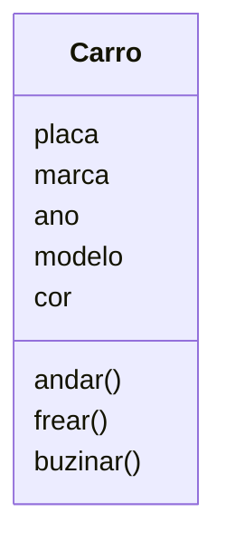
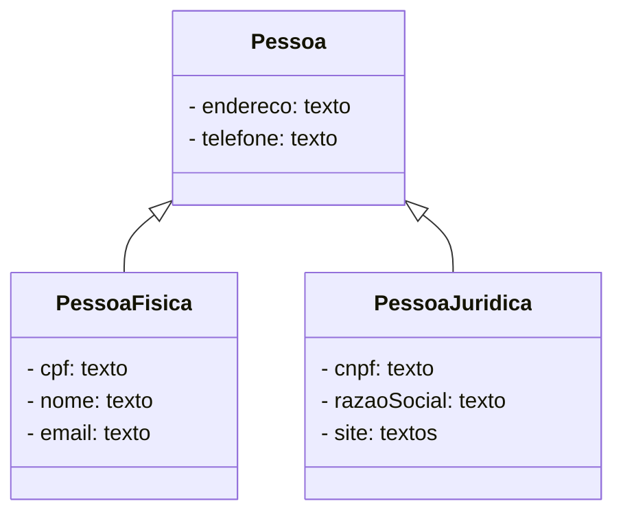
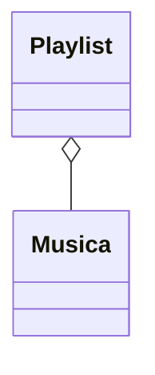
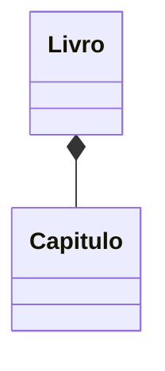
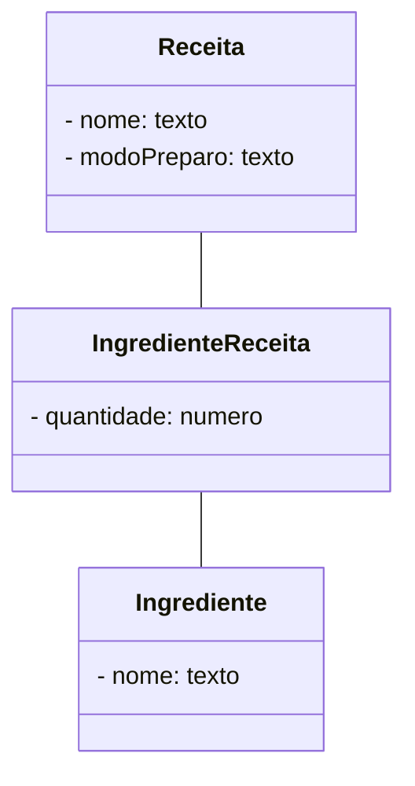
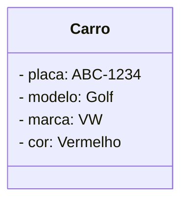

# Análise de Sistemas

## Introdução à Análise de Sistemas e Levantamento de Requisitos

- As atividades de análise de sistemas são de extrema importância no processo de desenvolvimento de um software;
- Muitas vezes as empresas negligenciam essas atividades por diversos motivos;
- É consenso que existe uma grande expectativa (e pressão) por parte dos clientes em receber o produto final que solicitaram, ou seja, um software pronto, contemplando todas as suas solicitações e, não raro, resolvendo todos os problemas de negócio;
- Diferentemente de muitos produtos que exigem um processo completo e muito bem formalizado para se chegar ao produto final, um software, muitas vezes por uma visão equivocada da equipe de desenvolvimento, aceita que algumas etapas do processo de desenvolvimento sejam suprimidas, e mesmo assim se chega a um software “funcionando”.

### Introdução à Análise de Sistemas

- As atividades de análise fazem parte do ciclo de desenvolvimento de um sistema e têm um papel de extrema importância na qualidade do produto final;
- Os prejuízos causados pela entrega de um software cujas etapas não foram seguidas da maneira correta são praticamente intangíveis;
- A demora na correção de um erro pode ocorrer devido à estrutura do software ter sido mal construída, aos programas terem sido codificados sem um padrão, sem uma estruturação dos módulos, sem planejamento nem análise, sem uma modelagem dos processos, ou seja, o que se diz na prática: “saíram programando direto”;
- Um software mal construído será carregado por anos (e talvez décadas), sempre com muito esforço (e dinheiro) para mantê-lo funcionando, sempre impactando negativamente a imagem da empresa e seus negócios.

#### Conceitos iniciais

- Segundo Stair e Reynolds (2015), sistemas de informação são componentes que interagem entre si, coletando, manipulando e disseminando dados e informações, a fim de atingir um objetivo;
- Já Laudon e Laudon (2005) definem sistemas de informação como um conjunto de elementos inter-relacionados que coleta, processa, armazena e distribui informações com o intuito de apoiar a tomada de decisão, a coordenação e o controle de uma organização;
- Já um software pode ser definido como um conjunto de instruções (programa de computador) que, ao ser executado por um computador, produz um determinado resultado desejado e adequado à finalidade para a qual foi construído (PRESSMAN; MAXIM, 2016).
- Os softwares correspondem à parte lógica do computador, consistindo em programas que controlam o trabalho do hardware (STAIR; REYNOLDS, 2015).

#### Histórico da análise de sistemas

- Os computadores surgiram na década de 1950, porém, até o início dos anos 1970, eram utilizados basicamente no meio científico e militar;
- Com a popularização do seu uso, principalmente em empresas, sistemas de informações começaram a ser construídos com o objetivo de resolver ou informatizar os processos de negócio dessas empresas;
- Inicialmente as linguagens de programação eram complexas, a produção de programas demandava muitas linhas de código e a forma de se passar instruções aos computadores era difícil e exigia muita habilidade dos programadores;
- Os programadores se preocupavam muito com as questões técnicas dos computadores e não conseguiam focar aquilo que realmente importava, ou seja, resolver o problema do seu usuário;
- Por causa disso, muitos erros eram cometidos, tanto de interpretação do negócio como de resolução equivocada do problema;
- Também, nessa época, não existia nenhuma estruturação dos processos a serem programados e muito menos uma organização dos dados utilizados pelo sistema.
- Para amenizar esse cenário, nos anos 1970 surgiram as teorias de análise. Tais teorias tinham o objetivo de fazer com que os profissionais tivessem um tempo para analisar o problema e estruturar uma solução antes da efetiva codificação dos programas.

##### Análise Estruturada

- A primeira teoria de análise que surgiu foi chamada de Análise Estruturada (YOURDON; CONSTANTINE, 1992);
- Basicamente a referida teoria procurou dar uma estrutura aos processos e introduziu o conceito de diagramas para demonstrar a solução do problema;
- Surgiram então os dois primeiros diagramas básicos da Análise, o Fluxograma e o Diagrama de Fluxo de Dados (DFD), que foram amplamente utilizados até meados dos anos 1980;
- Porém, mesmo com a introdução dessa fase de análise no processo de desenvolvimento do sistema, problemas e dificuldades continuavam acontecendo. A questão agora era a falta de estruturação dos dados que o sistema manipulava.
- Não existia uma forma definida e cada sistema organizava seus dados da maneira que imaginava ser a correta para a sua solução;
- Surgiram então os Sistemas Gerenciadores de Banco de Dados (SGBD), amplamente utilizados até os dias de hoje. A proposta desses sistemas era armazenar e fornecer ferramentas de manipulação desses dados, fazendo com que os programas somente fizessem solicitações aos SGBDs para consultar, atualizar, incluir e excluir seus dados.
- Surgiram então as técnicas de organização dos dados em forma de tabelas, linhas e colunas e foram introduzidas técnicas de normalização e relacionamentos entre os dados. Com isso, surgiram os bancos de dados.

##### Análise Orientada a Objetos

- Para amenizar essas questões, surgiu nos anos 1990 a Análise Orientada a Objetos (RUMBAUGH et al., 1994);
- O princípio básico dessa teoria é o conceito de encapsulamento, segundo o qual determinados dados devem ser manipulados somente por suas operações num componente chamado Objeto;
- A evolução das teorias de análise nos levou a modelos mais complexos, porém os problemas passaram a ser mais controlados e a qualidade dos sistemas m melhoraram, fazendo com que se chegasse a um padrão utilizado por todo o mercado de produção de sistemas;
- Não só a teoria de Análise Orientada a Objetos se solidificou no mercado, mas uma grande área surgiu para dar as diretrizes para todo o processo complexo de
  desenvolvimento de um software e foi chamada de Engenharia de Software, sendo seus precursores nomes como Roger S. Pressman, Bruce R. Maxim (PRESSMAN;
  MAXIM, 2016) e Ian Sommerville (SOMMERVILLE, 2011).

#### Ciclo de desenvolvimento de um sistema

- Para o completo desenvolvimento de um sistema, desde a necessidade de um cliente informatizar a solução de um determinado problema de negócio até a efetiva utilização do sistema no ambiente real, existe um ciclo de desenvolvimento cobrindo diversas atividades;
- Independentemente do tipo de ciclo, quatro fases básicas no processo sempre são identificadas: Iniciação, Elaboração, Construção e Transição (KRUCHTEN, 2003):
  - Iniciação: Como o nome já diz, é a fase em que se inicia a investigação acerca das necessidades do usuário, busca-se o entendimento do negócio e do problema a ser resolvido. São levantados os Requisitos (ou funcionalidades) que serão atendidos pelo sistema e é obtido um acordo (ou consenso) com as partes envolvidas (usuário e equipe de desenvolvimento);
  - Elaboração: Nessa fase é projetada uma solução que satisfaça os Requisitos. É feita a modelagem do sistema por meio de construção de documentos e diagramas que apresentem ao usuário uma ideia de como será o produto final. A equipe de analistas de sistemas toma como base os materiais produzidos na fase anterior;
  - Construção: Nessa fase são codificados os programas e componentes de software que se transformarão no produto final, um software funcionando. A equipe de programação toma como base todo o material produzido na fase anterior para construir um software como foi especificado no projeto;
  - Transição: Com os componentes de software construídos, nessa fase é feito o planejamento da entrega, os testes de software, bem como sua homologação pelo usuário e, finalmente, o software é liberado para o ambiente produtivo.
- Esse modelo foi amplamente utilizado pelas empresas durante anos. Suas desvantagens foram a formalização, o excesso de procedimentos e artefatos que eram construídos e, muitas vezes, não tinha utilidade por não agregar valor ao produto final.

### Levantamento de Requisitos

- A fase de Iniciação do ciclo de desenvolvimento de um sistema começa com o Levantamento de Requisitos;
- Essa tarefa é primordial para que o software seja desenvolvido da maneira correta e atenda totalmente às necessidades do cliente;
- Sua importância e sua abrangência são tão grandes que uma nova área foi criada, chamada Engenharia de Requisitos;
- O uso sistemático de técnicas para obter, documentar e manter as informações para conseguir uma Lista de Requisitos que atendem aos objetivos do cliente
  no seu negócio é uma boa definição de Engenharia de Requisitos;
- O profissional responsável por essas tarefas é o analista de requisitos (que também pode ser o analista de sistemas);
- Levantar Requisitos significa entender o negócio e o problema do cliente, identificar suas necessidades de software, investigar quais são as suas expectativas em relação à solução informatizada que será adotada, em resumo, definir o que o software vai fazer;
- Na fase de Levantamento de Requisitos, então, é definido o escopo do sistema para se ter claro a que o sistema vai atender (e também a que ele não vai atender) e, principalmente, são identificados os seus Requisitos.

#### Conceitos

- O conceito principal nessa área é o de **Requisito**. Segundo Vasquez (2016, p. 18), "é uma condição ou capacidade do sistema, solicitada pelo usuário, para resolver um problema ou atingir um objetivo". Na prática, os Requisitos são funções, objetivos, propriedades ou restrições que o sistema deve possuir para satisfazer usuários;
- De modo geral, um Requisito é uma condição necessária para satisfazer um objetivo, é uma exigência, solicitação, desejo e necessidade. Para Vasquez (2016):
  - Requisitos estão relacionados a necessidades: um usuário necessita que o sistema resolva seu problema ou o ajude a alcançar seu objetivo;
  - Requisitos estão relacionados a propriedades: um usuário deve possuir a condição dada pelo sistema para satisfazer um contrato, padrão, especificação ou outro documento formalmente imposto;
  - Requisitos possuem uma especificação: uma representação documentada de uma condição ou capacidade como nas duas primeiras definições.

#### Tipos de Requisitos

- Requisitos Funcionais:
  - Descrevem o comportamento que o software deve ter em termos de serviços para o negócio do usuário. Têm como objetivo as necessidades do assunto de que trata o sistema do cliente;
  - Os Requisitos Funcionais se referem às funções relacionadas com o negócio do cliente, com as funções que atendam diretamente às suas necessidades. Definem o que o sistema fará para atender ao pedido do cliente;
  - Exemplos:
    - O sistema deve cadastrar médicos profissionais;
    - O sistema deve emitir um relatório de clientes;
    - Executar a baixa dos boletos de contas a receber.
  - Quando um Requisito Funcional estiver escrito em um nível macro, passando uma ideia ampla, ele é chamado de Requisito Funcional Agregador;
  - Por exemplo: o Requisito Funcional Sacar dinheiro em um caixa eletrônico teria três subfunções:
    1. validar senha;
    2. verificar saldo;
    3. debitar conta.
- Requisitos não Funcionais:
  - Representam limitações ou determinações impostas aos Requisitos Funcionais;
  - Falam das condições do ambiente no qual o software será executado e como esse ambiente pode afetar ou restringir a perfeita realização dos Requisitos Funcionais;
  - Descrevem como o sistema deve funcionar. Entre outros aspectos, falam sobre:
    - O ambiente – segurança, comunicação etc;
    - A organização – locais de operação, tipos de hardware etc;
    - A implementação – linguagem de programação, Banco de Dados e arquitetura;
    - A qualidade – tempo de resposta, facilidade de uso, eficiência e facilidade de manutenção.
  - Exemplos:
    - Tempo de resposta on-line: todas as solicitações on-line feitas no sistema devem ter a resposta num tempo inferior a 15 segundos;
    - Disponibilidade do sistema: sistema deve estar disponível ao usuário 24 horas/dia permitindo paradas de até 5 minutos nos dias úteis e 1 hora em dias não úteis;
    - Autenticação dos usuários: todos os usuários devem ser autenticados ao ingressar no sistema e suas senhas devem estar criptografadas.

#### Elicitação de Requisitos

- Elicitação de Requisitos é a ação de aplicar as técnicas para o Levantamento dos Requisitos (VASQUEZ, 2016);
- Técnicas utilizadas no levantamento de requisitos:
  - Entrevistas e reuniões:
    - Uma entrevista ou reunião, no âmbito do Levantamento de Requisitos, consiste no processo de ouvir e registrar as necessidades e os desejos dos clientes;
    - O objetivo é deixar o cliente descrever seu problema, apontar possíveis soluções e, principalmente, demonstrar o funcionamento e as regras do seu negócio;
    - Primeiramente uma entrevista ou reunião deve ser guiada por uma pauta de perguntas muito bem elaboradas pelo analista de requisitos;
    - Para o bom andamento do encontro, algumas atitudes devem ser **evitadas**:
      1. Julgar/criticar as informações emitidas pelo outro;
      2. Completar frases ou cortar a fala;
      3. Ser arrogante ou deixar a impressão de que sabe mais do que o outro;
      4. Corrigir, seja informação técnica ou gramática;
      5. Dar a solução antes de ouvir o problema;
      6. Falta de cortesia, pontualidade e simpatia ou visual inapropriado;
      7. Local, hora ou duração inadequada;
      8. Vocabulário impróprio;
      9. Demonstrar despreparo sobre o assunto.
    - Uma entrevista ou reunião pode ter questões abertas e/ou fechadas, dependendo da necessidade de entendimento do assunto:
      - Questões abertas: Nesse tipo de questão, é possível investigar os detalhes, as opiniões e as preferências do cliente. Numa resposta textual, a tendência é que o cliente consiga explicar melhor o assunto;
      - Questões fechadas: Essas questões têm um conjunto de respostas predefinidas. Ele serve para delimitar o assunto em questão e restringir aquilo que se tem interesse em descobrir. A criação dessas questões deve ser muito bem estudada e organizada.
    - As questões de uma entrevista ou reunião (abertas ou fechadas) podem ter as seguintes estruturas:
      - Pirâmide: Nessa estrutura, inicia-se o encontro com questões fechadas e, dependendo das respostas, questões abertas podem ser inseridas para o detalhamento dessas respostas. É uma estrutura que permite o foco em subtópicos e facilita a organização do analista;
      - Funil: Ao contrário da anterior, inicia-se o encontro com questões abertas, e as fechadas são inseridas para tentar organizar ou detalhar as respostas das questões abertas;
      - Diamante: É uma combinação das anteriores. Inicia-se com questões fechadas e, em seguida, são inseridas questões abertas, podendo-se voltar às fechadas. Essa estrutura é mais dinâmica, porém a tendência é que o encontro fique mais longo.
      - 5W+2H:
        - What - o que será feito?
        - Why - por que será feito?
        - Where - onde será feito?
        - When - quando será feito?
        - Who - quem fará?
        - How - como será feito?
        - How much - quanto custará?

### Análise Orientada a Objetos (UML)

- No ciclo de desenvolvimento, a fase de Elaboração é a responsável pelo projeto de solução do sistema;
- Nela são produzidos artefatos (documentos e diagramas) que irão balizar a construção do software.

#### Conceitos

- O termo Unified Modeling Language ou linguagem de modelagem unificada (UML) surgiu da necessidade de se padronizar a linguagem de modelagem da Análise Orientada a Objetos e possibilitou a unificação da escrita dos diversos diagramas previstos na técnica;
- Com o tempo, esse termo passou a ser quase um sinônimo da Análise Orientada a Objetos (BOOCH; RUMBAUGH; JACOBSON, 2012);
- O conceito básico nessa teoria é o de Objeto, no qual os componentes de software foram considerados como objetos (do mundo real) com suas características e funções;
- Um Objeto tem encapsulado seus dados e operações responsáveis por manipular esses dados;
- Uma operação de um determinado Objeto não tem autorização (ou acesso) para manipular dados de outro Objeto se não pela solicitação ao Objeto
  responsável por esse dado.

#### Artefatos da UML

- Para a modelagem do sistema e representação da solução informatizada, a UML dispõe de diversos diagramas;
  - Digrama de caso de uso: apresenta graficamente todos os Requisitos do sistema, bem como a interação com as entidades externas;
  - Diagrama de Classes: é utilizado para modelar as classes de objetos, seus atributos, suas operações e relacionamento com outras classes;
  - Diagrama de Sequência: determina a sequência de mensagens que devem ser trocadas entre os objetos do sistema para que um caso de uso realize completamente sua função;
  - Diagrama de Atividades: permite demonstrar os fluxos de um processo. Pode ser usado para mostrar vários tipos de processos: um simples algoritmo, um caso de uso, um conjunto de casos de uso ou para mapeamento de processos;
  - Diagrama de Transição de Estado: permite demonstrar a mudança dos possíveis estados de um Objeto e as condições para que isso ocorra;
  - Diagrama de Pacotes: Permite a visualização dos pacotes de classes ou funções.

### Métodos Ágeis aplicados ao desenvolvimento de sistemas

- Os métodos de desenvolvimento ágil de software surgiram no início de 2000;
- Seu foco central era que os processos de produção de software deveriam se concentrar em indivíduos e interações sobre os processos e, principalmente, no produto final, ou seja, no software funcionando (COHN, 2011);
- A indústria de produção de software tornou-se extremamente burocrática e um grande esforço era dedicado à produção de documentos, diagramas e artefatos de modelagem que, em tese, deveriam ser úteis para melhorar a qualidade do produto final;
- O resultado, quase sempre, era o atraso na entrega do sistema, um alto custo e a equipe insatisfeita com a metodologia de trabalho;
- Segundo Prikladnicki, Willi e Milani (2014, p. XIV), “a única constante no desenvolvimento de software é a mudança, portanto criar mecanismos para adaptar-se a ela é mais eficaz do que tentar combatê-la”;
- Os Métodos Ágeis surgiram então com o objetivo de adotar práticas eficientes em todo o processo de desenvolvimento;
- Segundo Cohn (2011), os Métodos Ágeis se justificam por algumas razões:
  - Maior produtividade e menores custos;
  - Maior engajamento e satisfação no trabalho por parte da equipe de desenvolvimento;
  - Atendimento rápido às demandas do mercado;
  - Maior qualidade;
  - E, principalmente, maior satisfação do cliente.

#### Princípios e valores do Manifesto Ágil

- Os Métodos Ágeis surgiram então como uma filosofia de trabalho, uma forma de se estruturar equipes, uma nova maneira de se realizar as atividades;
- Essa filosofia foi materializada no que foi chamado de Manifesto Ágil (BECK et al., 2001), um documento que serviu de base para as organizações implantarem essa filosofia nas suas equipes de trabalho;
- Os quatro valores do Manifesto Ágil, assim como aparecem em Beck et al. (2001), são:
  1. Indivíduos e interações mais importantes que processos e ferramentas;
  2. Software funcionando mais que documentação abrangente;
  3. Colaboração com o cliente mais que negociação de contrato;
  4. Responder a mudanças mais que seguir um plano.
- Os 12 princípios do Manifesto (BECK et al., 2001):
  1. A maior prioridade é satisfazer o cliente por meio da entrega contínua e adiantada de software com valor agregado;
  2. Mudanças nos Requisitos são bem-vindas, mesmo tardiamente no desenvolvimento. Processos ágeis tiram vantagem das mudanças visando à vantagem competitiva para o cliente;
  3. Software deve ser entregue funcionando frequentemente, de poucas semanas a poucos meses, com preferência com menor escala de tempo;
  4. Pessoas de negócio e desenvolvedores devem trabalhar diariamente em conjunto durante todo o projeto;
  5. Projetos devem ser construídos em torno de indivíduos motivados. Eles devem ter o ambiente e o suporte necessário e receber confiança para fazerem o trabalho;
  6. O método mais eficiente e eficaz de transmitir informações para e entre uma equipe de desenvolvimento é a conversa face a face;
  7. Software funcionando é a medida primária de progresso;
  8. Os processos ágeis promovem desenvolvimento sustentável. Os patrocinadores, desenvolvedores e usuários devem ser capazes de manter um ritmo constante indefinidamente;
  9. Contínua atenção à excelência técnica e bom design aumentam a agilidade;
  10. Simplicidade: a arte de maximizar a quantidade de trabalho não realizado é essencial;
  11. As melhores arquiteturas, Requisitos e designs emergem de equipes auto-organizáveis;
  12. Em intervalos regulares, a equipe reflete sobre como se tornar mais eficaz e, então, refina e ajusta seu comportamento.

#### Introdução ao Scrum

- Scrum é uma ferramenta (comumente chamada de framework) usada para implementar o desenvolvimento ágil (COHN, 2011);
- O conceito básico do Scrum é a Sprint (nome dado para os ciclos do projeto);
- Para entendermos esse conceito, temos de conhecer os termos incremental e iterativo:
  - O desenvolvimento de um software de maneira incremental envolve a construção “pedaço por pedaço”: primeiro uma parte é desenvolvida, depois a próxima parte e assim por diante;
  - Por outro lado, o desenvolvimento iterativo aceita a possibilidade de retrabalho, de construir novamente aquilo que já foi feito, porém com um incremento de qualidade nessa nova construção;
- Uma Sprint do Scrum, então, combina as melhores características das duas abordagens, incremental e iterativa. Com isso, o cliente recebe entregas rápidas do
  produto e vai contribuindo para a sua melhoria;
- Os benefícios de se trabalhar com Sprints são:
  - O software funcionando encoraja o feedback do cliente;
  - O software funcionando ajuda a equipe a avaliar seu progresso;
  - O software funcionando permite que o produto seja entregue antes do desejado.
- É consenso na área de desenvolvimento de software que uma Sprint não deve demorar mais do que duas semanas (apesar de se admitir Sprints de até 30 dias);
- Além do conceito de Sprint, o Scrum define algumas práticas para serem seguidas (COHN, 2011; SUTHERLAND, 2019):
  - Reuniões diárias, rápidas e objetivas de apenas 15 minutos com a equipe de desenvolvimento;
  - Mostrar o trabalho visualmente usando o quadro (conhecido como Kanban);
  - Ter equipes enxutas com até dez pessoas;
  - Nada de títulos de função: estudos demonstram que quando não são criados títulos para as pessoas que possam limitar o entendimento de seu papel dentro de uma equipe, elas trabalham melhor;
  - Priorização: quando várias coisas são prioridade, nada é uma prioridade. Então, para que algo realmente seja feito, a metodologia Scrum propõe que as atividades devem ser priorizadas.

## Casos de Uso e Histórias de Usuário

### Diagrama de Caso de Uso

- O Diagrama de Caso de Uso tem como objetivo apresentar uma visão geral das funcionalidades do sistema, demostrando as entidades externas que terão acesso ao sistema e com quais funcionalidades cada entidade irá interagir (GUEDES, 2018; MELO, 2011);
- Segundo Booch, Rumbaugh e Jacobson (2012, p. 263), “os diagramas de caso de uso são importantes para visualizar, especificar e documentar o comportamento de um sistema”;

#### Conceitos

- Um Diagrama de Caso de Uso é composto de três elementos básicos: ator, caso de uso e relacionamento.

##### Ator

- Os atores representam entidades externas ao sistema e que interagem com ele (DEBONI, 2003);
- Existem três tipos de atores:
- Pessoas: são os atores mais fáceis de serem identificados. São as pessoas que irão manipular as telas, receber relatórios e fazer consultas aos dados;
- Órgãos de uma organização: em uma organização (empresa, indústria, loja, escritório, clube, dentre outros), um determinado órgão pode ser considerado um ator quando todas as pessoas desse órgão interagirem com o sistema;
- Outros sistemas informatizados: esse é o ator mais difícil de ser identificado. Quando construímos um software, é comum que ele tenha ligação com softwares externos, pertencentes ou não à mesma organização.

##### Caso de uso

- Um caso de uso representa um determinado Requisito, é uma funcionalidade completa conforme percebida pelo ator. Ele fornece um resultado observável ao ator e contribui para que o ator atinja seu objetivo;
- Os casos de uso derivam da Lista de Requisitos;

##### Relacionamento

- Os relacionamentos têm por objetivo fazer as ligações entre os atores e casos de uso;
- Existem cinco tipos de relacionamentos que podem ser utilizados em um Diagrama de Caso de Uso:
  1. Ligação: as ligações são feitas entre atores e casos de uso para indicar exatamente com quais casos de uso cada ator irá interagir. A ligação é representada por uma linha simples, sem setas e nem legendas;
  2. Herança de atores: o conceito de herança é uma das bases da Análise Orientada a Objetos. Ele é aplicado não só para atores, mas para casos de uso e, principalmente, para as classes. A herança é representada por uma linha com uma seta vazada saindo dos atores mais específicos e apontando para o ator mais geral;
  3. Herança de casos de uso: Assim como temos herança de atores, podemos ter herança de casos de uso seguindo o mesmo conceito;
  4. Include (ou uso): O relacionamento de Include (ou uso) é exclusivo para ser utilizado entre casos de uso. Quando queremos separar uma parte dos procedimentos de um caso de uso criando um novo caso de uso com essa parte, esses dois casos de uso devem ficar ligados por meio de um Include. O símbolo de Include no Diagrama de Caso de Uso é uma seta pontilhada apontada para o caso de uso chamado e com a legenda <\<include>> na linha;
  5. Extend (ou extensão): o relacionamento de Extend (ou extensão) também é exclusivo para ser usado entre casos de uso. Seu funcionamento é muito parecido com o Include, ou seja, existe a chamada de um caso de uso por outro para que se realize um determinado procedimento e retorne ao caso de uso original. O símbolo de Extend no Diagrama de Caso de Uso é uma seta pontilhada apontada para o caso de uso chamador (é o contrário do relacionamento de Include) e com a legenda <\<extend>> na linha.

### Níveis do Diagrama de Caso de Uso

- Os Métodos Ágeis nos mostram a necessidade de se construir os artefatos da análise (diagramas ou documentos) na medida em que tenham utilidade no processo de desenvolvimento;
- Dependendo dessa utilidade, o Diagrama de Caso de Uso pode ser construído em dois níveis: o nível 1, mais geral, e o nível 2,
  mais detalhado.

#### Nível 1 do Diagrama de Caso de Uso

- Nesse nível, não devemos utilizar os relacionamentos de herança de atores ou casos de uso, Include e Extend;
- A ideia desse nível é que se tenha uma visão mais geral, sem muito detalhamento;
- Nele, os casos de uso não necessitam corresponder a uma tela.

#### Nível 2 do Diagrama de Caso de Uso

- O objetivo desse nível é fazer um detalhamento dos casos de uso, em que cada um irá corresponder a uma tela física;
- Para isso, pode-se utilizar todos os cinco tipos de relacionamentos do diagrama.

### Prototipação de telas

- Criar protótipos de telas significa desenhar os esboços que serão efetivamente construídos usando as linguagens de programação;
- Os protótipos de telas são criados pelos analistas de sistemas que participaram da fase de Levantamento de Requisitos e têm ampla visão do negócio e da solução informatizada que será dada ao problema;
- Fazer protótipos das telas do sistema torna muito fácil a avaliação por parte do cliente.

#### Componentes de um protótipo de tela

- Existem diversos componentes que podem ser utilizados na construção de telas, cada um com uma finalidade específica;
- Esses componentes também ajudam na estruturação da tela e na facilitação de seu uso;
- Os principais são:
  - Label: esse componente é o mais simples e é utilizado quando se deseja escrever um texto na tela, seja em títulos e textos quaisquer ou para legenda de campos de entrada;
  - Text field: o campo de entrada é utilizado quando se deseja que o usuário digite um determinado conteúdo de texto ou número no campo da tela;
  - Button: são botões disponíveis na tela para o usuário pressionar levando o sistema a realizar alguma ação;
  - Grid: é utilizado quando se deseja mostrar dados em forma de tabelas;
  - Calendar: é utilizado quando se deseja o calendário de meses, inclusive com navegação entre as datas;
  - Check box: é utilizado quando se deseja apresentar uma lista de valores para que o usuário selecione uma ou mais opções;
  - Combo box: é utilizado quando se deseja apresentar uma lista de valores para que o usuário selecione apenas uma opção. Normalmente a primeira opção fica
    visível como primeira da lista e, ao pressionar uma seta no componente, a lista é aberta e apresenta-se as demais opções;
  - Date chooser: é utilizado quando se deseja a entrada de uma data na tela, porém com a opção de apresentação de um calendário e a possibilidade de escolha dessa data;
  - Text area: assim como o text field, é utilizado quando se deseja que o usuário digite um determinado conteúdo de texto, porém, nesse componente, é possível
    escrever um texto com várias linhas, inclusive dando a possibilidade de dimensionar a área;
  - Menu bar: é utilizado quando se deseja montar menus de opções para escolha do usuário que remetem a outras telas.

### Histórias de Usuário

- O desafio do analista de sistemas é fazer com que o programador entenda exatamente o que deve ser programado, tanto o funcionamento da tela quanto as regras de negócio que devem ser verificadas para que o Requisito seja entregue exatamente como foi solicitado;
- As Histórias de Usuário, então, entram nessa fase como um instrumento de detalhamento de cada um dos casos de uso (telas) para que o documento seja repassado ao programador e transformado num programa de software;
- Assim, o próximo passo do processo de modelagem é escrever Histórias de Usuário para que sejam repassadas aos programadores da equipe;
- Para cada caso de uso do Diagrama de Caso de Uso de nível 2 (ou de nível 1 caso só tenha sido feito esse), o analista deve fazer o seu detalhamento por meio de uma História de Usuário.

#### Construção de uma História de Usuário

- Nome e descrição:
  - O nome da História deve ser o mesmo nome do caso de uso do Diagrama de Caso de Uso de nível 2 (ou nível 1);
  - Ele deve iniciar com a sigla HU seguida de um número sequencial;
  - Exemplo:
    - HU000 – Nome da História de Usuário.
  - Em seguida, devemos fazer uma descrição no seguinte formato:
    - Sendo: (ator) <- Quem quer;
    - Quero: (funcionalidade) <- O que quer;
    - Para: (benefício) <- Por que quer.
  - Exemplo:
    - Sendo: um aluno da escola;
    - Quero: realizar matrícula;
    - Para: estar regularizado e iniciar a atividade escolhida.
- Desenho da tela:
  - Nesse tópico deve ser colocado o desenho da tela conforme o protótipo que foi feito para ela.
- Critérios de aceitação:
  - Os critérios de aceitação são verificações que o sistema deve fazer para considerar que a História está atendendo aos Requisitos do cliente;
  - A História é considerada pronta somente após todos os critérios serem verificados;
  - Exemplo:
    - Critério: não deve aceitar CPF em branco ou inválido.
- Critérios de aceitação – detalhamento:
  - Após a escrita da lista de critérios de aceitação, deve-se fazer um detalhamento de cada um deles;
  - O detalhamento dos critérios deve ter o seguinte formato:
    - Critério: (Descrição);
    - Dado que: (precondição);
    - Quando: (ação);
    - Então: (reação).
  - Exemplo:
    - Critério: não deve aceitar CPF em branco ou inválido;
    - Dado que: foi informado um CPF Inválido;
    - Quando: o aluno pressiona o botão "Efetivar Matrícula";
    - Então: o sistema apresenta a mensagem "CPF Inválido";
    - E: o sistema não efetiva a matrícula.
- Regras de negócio:
  - As regras de negócio explicam a maneira de realizar certos procedimentos;
  - É uma explicação de **como** deve ser realizada uma determinada ação;
  - As regras de negócio devem ser listadas da seguinte maneira:
    - Rn: Descrição da Regra de Negócio (Onde **n** é um número sequencial da regra).
  - Exemplo:
    - R1: A consistência do Dígito Verificador do CPF deve ser feita utilizando a rotina módulo 11 da Receita Federal.
- Outros artefatos:
  - Deve-se relacionar nesse tópico os artefatos da UML que possam ajudar o programador na implementação da História;
  - Exemplos:
    - Clique aqui para acessar o Diagrama de Classes;
    - Clique aqui para acessar o Diagrama de Sequência.
- Observações técnicas:
  - Deve-se relacionar nesse tópico as observações que achar pertinente relacionadas às ferramentas tecnológicas que serão usadas na programação da História;
  - Exemplo:
    - Usar componentes de JavaScript na saída dos campos da tela;
- Histórias relacionadas:
  - Caso a História que está sendo escrita tenha relação com outras Histórias importantes que o programador conheça, podemos citá-las aqui;
  - Exemplos:
    - HU002 – Pesquisar Alunos;
- Critérios de aceitação para testes:
  - O objetivo desse tópico é balizar os testes da História, ou seja, devemos prover a equipe de testes do sistema com recursos para que a História seja estada após sua implementação;
  - Nesse tópico, devemos então repetir todos os critérios de aceitação, com a diferença de que aqui deve ser colocado valores reais nas entradas de campos da tela ou consistências necessárias;
  - Exemplo:
    - Critério: não deve aceitar CPF em branco ou inválido;
    - Dado que: foi informado o CPF J98.188.888 (inválido por causa da letra J no início);
    - Quando: o aluno pressiona o botão "Efetivar Matrícula";
    - Então: o sistema apresenta a mensagem "CPF Inválido";
    - E: o sistema não efetiva a matrícula.

## Objetos e Classes

- A grande inovação trazida pela Análise Orientada a Objetos foi justamente o conceito de objeto;
- A organização da solução, em termos de objetos, fez com que os sistemas tivessem uma melhor estrutura;
- Dentre todas as tarefas de modelagem de um sistema, a organização dos objetos é a de maior importância. Construir um sistema em torno de objetos é mais
  importante do que em torno de suas funções, pois são mais adaptáveis a modificações (RUMBAUGH et al., 1994).

### Objetos

- Segundo Rumbaugh et al. (1994, p. 31), “definimos um objeto como um conceito, uma abstração, algo com limites definidos e significado em relação ao problema”;
- Um objeto, para efeitos de estruturação do sistema, possui três elementos, são eles:
  - Identificação:
    - Cada objeto é único e deve ter uma identificação que não pode ser usada em outros objetos;
    - Por exemplo, uma pessoa pode ser identificada por seu CPF, pois esse número, pelo menos em termos legais, é único, ou seja, não existem duas pessoas com o mesmo número de CPF.
  - Atributos:
    - São as características ou propriedades de um objeto;
    - Eles identificam um determinado estado do objeto, pois um atributo pode ter um determinado valor que pode mudar no decorrer do tempo;
    - Os atributos representam peculiaridades que costumam variar de um objeto para outro e permitem diferenciar um objeto de outro (GUEDES, 2018).
  - Métodos:
    - Consistem no que o objeto consegue produzir; são as suas ações, suas operações, seu comportamento ou suas funções;
    - Eles representam uma atividade que o objeto consegue executar (GUEDES, 2018);
    - Um método pode ou não alterar o valor de um ou mais atributos;
    - É a implementação de algum serviço que pode ser solicitado por algum objeto para mudar um ou mais comportamentos (BOOCH; RUMBAUGH; JACOBSON, 2012);
    - A UML se refere aos métodos com o termo operações, porém o termo mais comumente utilizado na modelagem, e também na programação, é método.
- Exemplo de um objeto **carro**:
  - Identificação:
    - Carro placa ABC-1234.
  - Atributos:
    - Marca: VW;
    - Ano: 2023;
    - Modelo: Golf;
    - Cor: Vermelho.
  - Métodos:
    - Andar;
    - Frear;
    - Buzinar.
- Pelo fato de os atributos e métodos estarem juntos no objeto, dizemos que eles estão encapsulados no objeto;
- Encapsulamento é um importante conceito da Análise Orientada a Objetos; sua função é que os métodos “protejam” os atributos do acesso descontrolado, ou seja, o acesso aos atributos é realizado por intermédio de seus métodos;

### Classes

- Uma classe é um modelo, um protótipo usado para criar vários objetos com características semelhantes;
- Para Rumbaugh et al. (1994, p. 32), "uma classe de objetos descreve um grupo de objetos com propriedades semelhantes (atributos), o mesmo comportamento (operações), os mesmos relacionamentos com outros objetos e mesma semântica";
- As classes são meras descrições dos objetos que as compõem, são especificações que descrevem os seus objetos;
- Podemos também imaginar uma classe como uma receita de bolo. A receita não é o bolo, mas a descrição de como fazer um bolo. Quando usamos essa receita para efetivamente fazer um bolo, criamos um objeto (o bolo) dessa classe.
- Uma classe terá atributos e métodos, porém, como é uma mera descrição dos diversos objetos que serão criados por meio de sua especificação, nas classes não
  serão atribuídos os valores aos atributos (já que não se tem esses valores);
- Ela será representada por um retângulo com três compartimentos. No primeiro, temos o nome da classe, no segundo a sua relação de atributos, e no terceiro a
  relação de métodos da classe;
- Exemplo:

### Mensagens

- Uma mensagem é a invocação de um método de determinada classe para que um método de outra classe seja executado;
- É comum que em um determinado processo um objeto necessite buscar os valores de atributos de outro objeto ou mesmo fazer alterações nesse valor;
- Devido ao conceito de encapsulamento, esse objeto não tem permissão para acessar diretamente atributos de outros objetos, então a forma de se comunicar é por meio de mensagens entre objetos.

### Herança

- O termo _herança_ é bastante forte na Análise Orientada a Objetos; na verdade, esse conceito nasceu com essa teoria;
- Ele também pode ser utilizado entre atores e casos de uso;
- A herança entre classes é a capacidade de uma classe (chamada de filha) herdar as características (atributos e métodos) de outra classe (chamada de mãe);
- A classe filha terá todas as suas características e mais as características da classe mãe;
- Uma classe mãe pode ter uma ou mais filhas. Em outras palavras, usamos herança quando existem diversos tipos de uma determinada classe;
- Exemplo de herança da classe _Pessoa_:

### Padrões

- Os nomes de classes, atributos e métodos devem ser escritos em um determinado padrão;
- Isso facilita o entendimento e a comunicação entre os membros da equipe de desenvolvimento e irá balizar a implementação em uma linguagem de programação, já que é a etapa seguinte no processo de desenvolvimento do sistema;
- Padrão para nomes de classes:
  - Utilizar nomes no singular;
  - Evitar abreviaturas;
  - Não utilizar hifens, tracinhos ou espaços;
  - Não usar acentuação ou cedilha;
  - Não usar preposições (de, para, do, com, entre outras);
  - Não usar palavras desgastadas (Tabelas, Cadastro);
  - A primeira letra do nome deve ser maiúscula e as demais, minúsculas.
- Exemplos de nomes de classes no padrão:
  - Cliente;
  - PessoaFisica;
  - ContaPoupanca.
- Padrão para nomes de atributos:
  - Não utilizar hifens, tracinhos ou espaços;
  - Não usar acentuação ou cedilha;
  - Não usar preposições (de, para, do, com, entre outras);
  - É possível usar abreviaturas;
  - É possível usar palavras no plural;
  - Usar letras minúsculas. Caso haja vários nomes, o primeiro inicia com minúscula, e a partir do segundo a primeira letra deve ser maiúscula.
- Exemplos de nomes de atributos no padrão:
  - idade;
  - nomeCliente;
  - qtdAlunosMatriculados (quantidade de alunos matriculados).
- Padrão para nomes de métodos:
  - Não utilizar hifens, tracinhos ou espaços;
  - Não usar acentuação ou cedilha;
  - Não usar preposições (de, para, do, com, entre outras);
  - É possível usar abreviaturas;
  - É possível usar palavras no plural;
  - Usar letras minúsculas. Caso haja vários nomes, o primeiro inicia com minúscula, e a partir do segundo a primeira letra deve ser maiúscula.
  - Como um método é uma ação, a primeira palavra deve ser um verbo no infinitivo (verbo na forma natural), ou seja, somente a leitura do nome do método já deve indicar a sua ação.
- Exemplos de nomes de métodos no padrão:
  - calcularSaldoDevedor;
  - imprimirBoleto;
  - incluirCliente.

### Relacionamentos entre as classes

- Normalmente, uma classe não está isolada em um sistema. É bem comum que seus objetos estejam relacionados aos objetos de outras classes;
- Ao identificarmos e organizarmos as classes, descobriremos que dificilmente elas trabalharão sozinhas. A maioria das classes colaboram umas com as outras e
  seus objetos se relacionam entre si (BOOCH; RUMBAUGH; JACOBSON, 2012). Para essa relação, damos o nome de relacionamento entre as classes;

#### Associação

- O relacionamento de associação representa a existência de alguma conexão entre os objetos das classes, de modo que um objeto de uma classe deve manter alguma referência ao objeto da outra;
- A associação faz com que uma classe colabore com a organização de outra classe (MELO, 2010);
- Associações simples são representadas na forma de uma linha cheia conectando as duas classes;
- As associações são bidirecionais, pois um objeto de uma classe está ligado a um objeto de outra classe e vice-versa, que são definidas, na maioria das vezes, pelas regras de negócio do sistema (RUMBAUGH et al.,1994);
- Por conta disso, as associações devem possuir o que chamamos de multiplicidade, para indicar com qual quantidade de objetos uma classe está associada a outra (nos dois sentidos);
- Exemplos:

| Notação | Significado        |
| ------- | ------------------ |
| \*      | Muitos             |
| 0..\*   | Zero, um ou muitos |
| 1..\*   | Um ou Muitos       |
| 1..6    | De um até seis     |

- Quando associamos duas classes, na qual um objeto da primeira classe está associado com muitos da outra classe, comumente chamamos essa associação de **1-para-muitos**;
- Quando muitos objetos de uma classe se associam com muitos de outra classe, chamamos essa associação de **muitos-para-muitos**;
- Finalmente, quando somente um objeto de uma classe está associado a somente um de outra classe, chamamos de associação **1-para-1**.

#### Agregação

- Uma agregação entre duas classes denota que uma delas possui as características do todo do objeto e a outra corresponde às suas partes. Ela é um tipo especial de associação;
- Nas agregações, as duas classes devem ter a característica de **todo-parte**, na qual uma das classes representa o todo e a outra representa as partes desse todo;
- A notação para o relacionamento de agregação é uma linha com um **losango vazado** na extremidade, que representa a classe "todo".
- Exemplo:

- Uma agregação permite que um objeto na classe que representa o todo não esteja relacionado com nenhuma parte.

#### Composição

- A composição é um tipo especial de agregação, ou seja, também tem a característica todo-parte, porém, nesse caso, uma parte deve pertencer a um único todo;
- Na composição, o tempo de vida do todo e das partes coincidem. Uma vez criados os objetos de ambas as classes, eles nascem e morrem juntos (BOOCH; RUMBAUGH; JACOBSON, 2012);
- A notação para o relacionamento de composição também é uma linha com um **losango** na extremidade, que representa a classe “todo”, porém, nesse caso, esse losango é preenchido;
- Exemplo:

#### Classe de associação

- Pode ocorrer de uma associação entre duas classes necessitar de um atributo;
- Quando isso ocorre, uma classe de associação deve ser colocada entre duas classes com associação **muitos-para-muitos**;
- Para acomodar então esse atributo, podemos criar o que chamamos de classe de associação;
- Exemplo:

### Diagrama de Classes

- Depois de conhecermos todos os principais conceitos de objetos, classes e seus relacionamentos, devemos construir um diagrama, no qual serão colocadas todas
  as classes de um determinado sistema, com seus atributos, métodos e relacionamentos. Fazemos isso construindo o Diagrama de Classes;

#### Diagrama de Classes de nível 1

- No Diagrama de Classes de nível 1, colocamos as classes do sistema, seus atributos próprios e seus relacionamentos com outras classes;
- Nessa etapa, não colocaremos os métodos das classes, pois o melhor momento para se identificar os métodos é a construção do Diagrama de Sequência;
- O Diagrama de Classes é construído à partir da Lista de Requisitos;
- Passos para a construção do Diagrama de Classes de nível 1:
  1. Identificação das classes e seus atributos: de posse da Lista de requisitos, devemos identificar as classes que irão compor o diagrama;
  2. Colocação dos relacionamentos entre as classes: nesse passo, analisamos as classes para verificar quais relacionamentos devemos colocar entre elas.
- Diagrama de Classes de nível 2:
  - O Diagrama de Classes de nível 2 é uma expansão do nível 1, no qual são detalhados os atributos advindos das associações. Esses atributos são chamados de atributos associados ou _atributos de ligação_ (RUMBAUGH et al., 1994);
  - Na construção do Diagrama de Classe não são colocados os métodos das classes, o melhor momento para colocá-los é após a confecção dos Diagramas de Sequência.

### Diagrama de Objetos

- O Diagrama de Objetos tem por objetivo a visualização de alguns objetos nas classes;
- Com ele é possível verificar se foram identificados todos os atributos necessários para as classes, se algum deles está na classe errada, e ter uma visão geral de como serão os objetos das classes quando o sistema for efetivamente usado;
- Esse diagrama está amplamente associado ao Diagrama de Classes e pode ser considerado seu complemento, pois fornece uma visão dos valores armazenados pelos objetos em um determinado momento (GUEDES, 2018);
- A construção desse diagrama tem como base o Diagrama de Classes de nível 1, em que cada classe é colocada e são atribuídos valores aos atributos ao lado de cada um deles (após os dois pontos, depois do nome do atributo e entre aspas);
- Exemplo:

